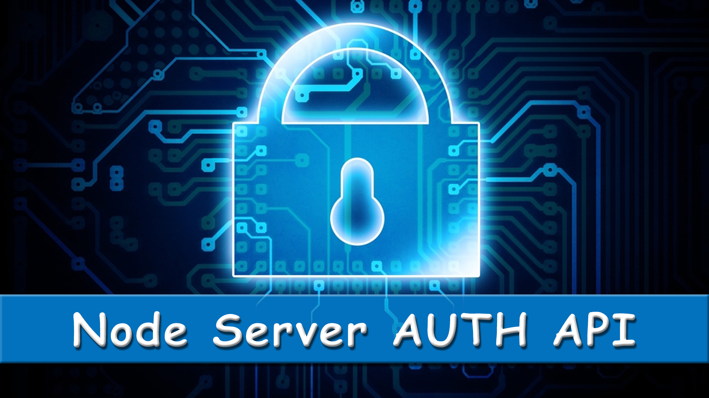

# Node Server Auth API

<div align="center">

</div>
```
> git clone https://github.com/jwill9999/Node_Auth_API_with_JWT_Boilerplate.git
> cd Node_Auth_API_with_JWT_Boilerplate
> npm install
> connect to your database first then
> npm run dev
> Server is run on port 3000
```
## API Endpoints

> /signin

> web_token POST in header as authorization key 

> /signup

> web_token returned as json object to user 


## Additional setup

> connect a Mongodb database prior to running the API server

> environmental variables should be declared in a .env file

> The two variables you should declare are

> JWT_SECRET

> DATABASE_CONNECTION


## Key Features

> Node Express Server

> API Backend

> MongoDb Database   

> Authorisation

> Passport Js Local and JWT 

> Json Web Tokens

> AuthGuards

> Bcrypt Salt and Hash Encryption


## Links

[Expressjs](https://expressjs.com/)

[passportjs Local](http://passportjs.org/docs/username-password)

[Passportjs JWT](https://github.com/themikenicholson/passport-jwt)

[MongoDb Docs](https://docs.mongodb.com/manual/)

[Bcrypt for nodejs](https://github.com/shaneGirish/bcrypt-nodejs)

[Dotenv Documentation](https://www.npmjs.com/package/dotenv)


